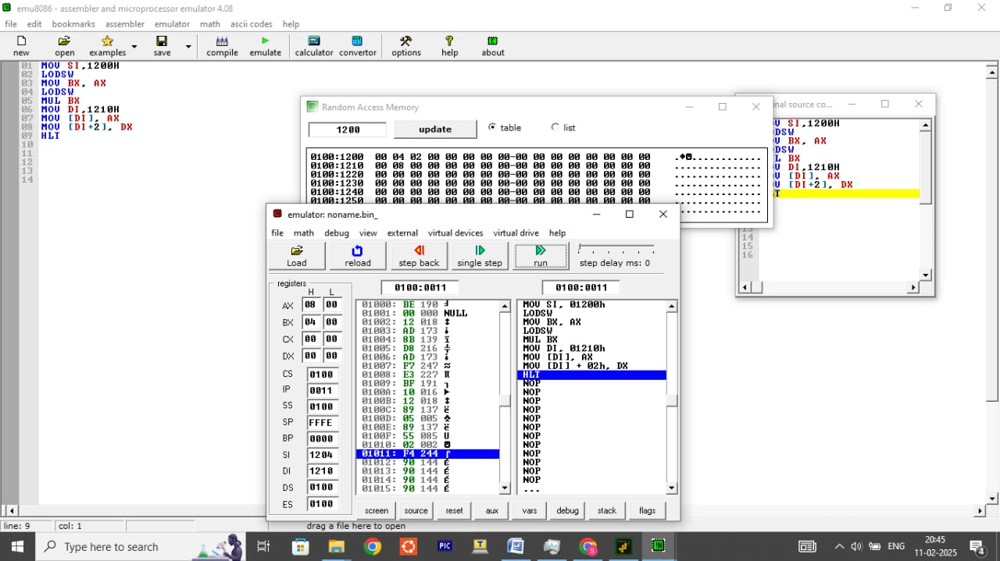

# 💻 Computer-architecture
🎓 **Register Number:** 192424081  
🤗 **NAME:** THARANKESWARAN 
## 8086-microprocessor

### 1️⃣ ADDITION

```assembly
MOV SI,1200H
LODSW
MOV BX, AX
LODSW
ADD BX, AX
MOV DI, 1210H
MOV [DI],BX
HLT
```
INPUT:

1200  `12H`          1201  `12H`

1202  `14H`          1203   `14H`

OUTPUT:

1210  `26H`

1211  `26H`


### 2️⃣ SUBTRACTION

```assembly
MOV SI,1200H
LODSW
MOV BX, AX
LODSW
SUB BX,AX
MOV DI, 1210H
MOV [DI],BX
HLT
```
INPUT:

1200  `08H`          1201  `08H`

1202  `04H`          1203   `04H`

OUTPUT:

1210  `04H`

1211  `04H`
### 3️⃣ MULTIPLICATION

```assembly
MOV SI,1200H
LODSW
MOV BX, AX
LODSW
MUL BX
MOV DI,1210H
MOV [DIJ, AX
MOV [DI+2], DX
HLT
```
INPUT:

1200  `04H`          1201  `04H`

1202  `02H`          1203   `02H`

OUTPUT:

1210  `08H`

1211  `08H`


### 4️⃣ DIVISION

```assembly
MOV DX,0000
MOV AX,0006H
MOV CX,0004H
DIU CX
MOV DI,1300H
MOV [DI],AH
INC DI
MOV [DI],AH
INC DI
MOV [DI]1,DX
```
INPUT:

AX   `0006H`

CX   `0004H`

OUTPUT:

1300  `01H`

1301  `00H`

1302  `02H`

-------------------------------------------------
